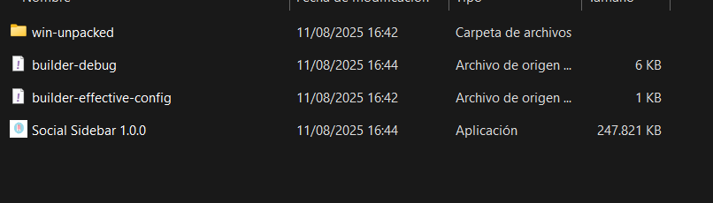
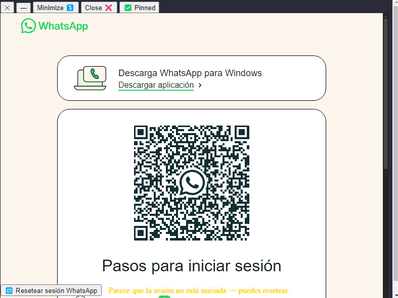

# WhatsApp Desktop Lite - Lightweight Client

## Key Features ✨

- **Standalone WhatsApp Access** — Use WhatsApp without the browser or the official app.
- **Smart Window Behaviors**:
  - 📌 **Always On Top** — Keep the window visible above others.
  - ⤵️ **Minimize on Focus Loss** — Automatically minimize when clicking outside (optional).
  - ❌ **Close on Focus Loss** — Hide to the system tray when losing focus (optional).
- **Persistent Sessions** — Stay logged in between sessions.
- **Lightweight** — Minimal resource usage compared to running WhatsApp in a browser.
- **Cross-Platform** — Works on Windows, macOS, and Linux.

## Quick Installation

1. Download the `win-unpacked` folder from the build artifacts (if applicable).
2. Inside `win-unpacked` you will find all the program files and the main executable `Social Sidebar.exe`.
3. To run the app on Windows, **double-click** `Social Sidebar.exe`.

---

## Usage Guide 🚀

### Screenshots (included in the repo)

  
**dist1.png** — Inside the `win-unpacked` folder you will find all the files for the program. The main executable file is **`Social Sidebar.exe`**. Double-click this `.exe` to start the application.

  
**dist2.png** — View of the application while running. The button shows **`Pinned`**, meaning the window is in *always on top* mode (the app stays visible on your screen while you perform other tasks).  

- If you prefer the window to minimize when clicking outside it, press the **Minimize** button.  
- If you want the app to stop showing when clicking outside (for example, if you just wanted to send a quick message), press the **Close** button to hide it or send it to the tray (depending on your configuration).

---

### Window Controls

- **✕ Close Button**: Hides the app to the system tray (default/configurable behavior).  
- **— Minimize Button**: Minimizes the window to the taskbar.  
- **📌 Pin Toggle**:
  - **Default — `Pin`**: The app is not fixed (normal behavior).  
  - **Active — `Pinned`**: The window stays **always on top** of other windows.

### Focus Loss Behaviors
These options define what happens when you click outside the window:

```plaintext
"Minimize ⤵️" : Minimizes the window when clicking outside.
"Close ❌"    : Hides the application (e.g., to the system tray) when clicking outside.
"None"        : Do nothing when focus is lost (useful with Pinned).

